# Reporte Técnico: Proyecto Cubo Rubik

## 1. Nombre completo del autor(a)
Dayan Aguilar Alcocer

## 2. Breve descripción del proyecto
El proyecto consta de 3 clases:

- **Cubo**: Es la clase donde se encuentran todas las funciones que realizan un cubo Rubik. Destacan las siguientes:
   - **Iniciador**: Carga un cubo desde un estado que se pasa como argumento. Si no se proporciona un estado, se genera un estado resuelto.
   - **Movimientos**: Contiene 3 movimientos principales.

   

   - **Mostrar**: Muestra un cubo ya formateado para que el usuario entienda cuáles son las caras, como se indica en la imagen:
       - U: Up (arriba)
       - F: Front (frente)
       - L: Left (izquierda)
       - R: Right (derecha)
       - B: Back (atrás)
       - D: Deep (abajo)

   

- **Buscador**: Es la clase que recibe el cubo en sí. Se envía un cubo y una heurística que se tiene que generar en un archivo `.txt`. Se envía un diccionario de heurística y tiene 2 algoritmos de búsqueda de estado: `ida_star` y `a_star` (se explicarán en el paso "5.2"). Se usa de la siguiente manera:

   

- **Main**: Es el archivo principal donde se utilizan todas las funciones.

   

   Esta función genera la heurística y la coloca en un archivo de texto. Tarda de de 3 a 7 **minutos**

   

   Esta función toma los archivos existentes y los convierte en un archivo de texto. Al leer el archivo, se explica el formato:

   

   El formato funciona de la siguiente manera, donde las líneas negras son las caras y las líneas de colores son las filas:

   

## 3. Requerimientos del entorno de programación
- Python 3.11.1
- 300 a 700 MB de espacio en disco
- Visual Studio Code

## 4. Manual de uso

### 4.1. Formato de codificación para cargar el estado de un cubo desde el archivo de texto

Como ya se explicó cómo se usan los cubos con los archivos de texto, veremos la función y cómo llamarla para cargar un estado:

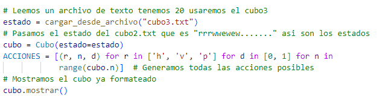

### 4.2. Instrucciones para ejecutar el programa
*Ejecutar el archivo **main.py*** si no se muestran los ***resultados*** a la primera ejecucion por favor vuelva ejecutar el **main.py**

**Tarda dependiendo el cubo pero no pasa mas de 5 min en encontrar la solucion**

Una vez creado el cubo con el estado cargado desde un archivo, tenemos que usar la clase `Buscador` ya creada con la heurística y el cubo:

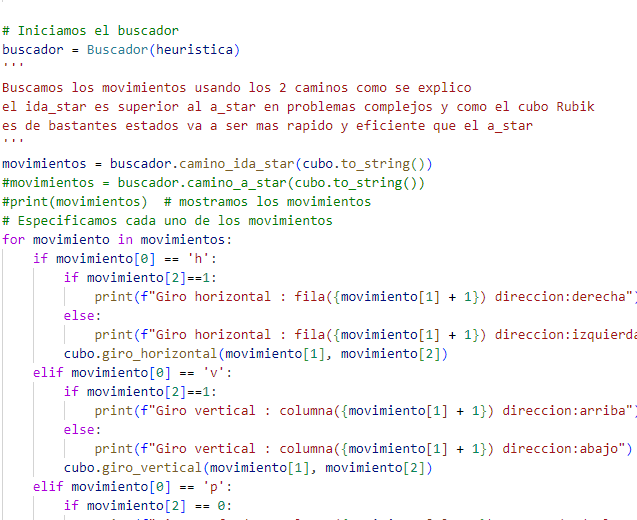

Este es el resultado:

## 5. Diseño e implementación

### 5.1. Breve descripción del modelo del problema

-Se usaron 2 clases y 3 funciones que son las principales
 las clases principales son:

 *--Cubo*

 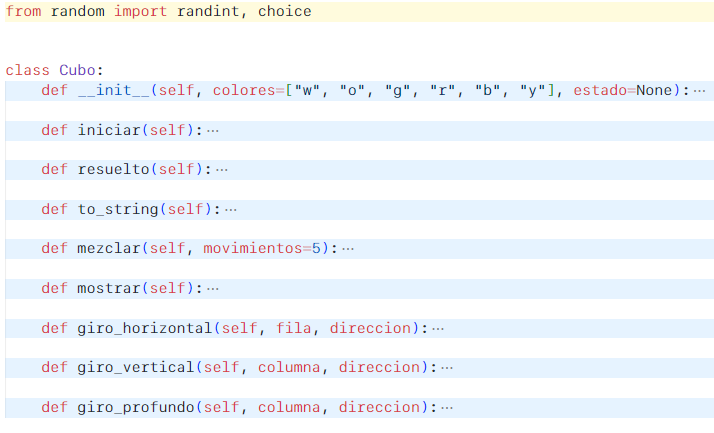

 *--Buscador*

 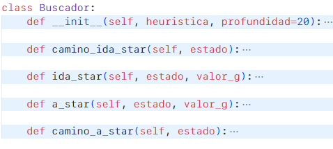

 *--Funciones*

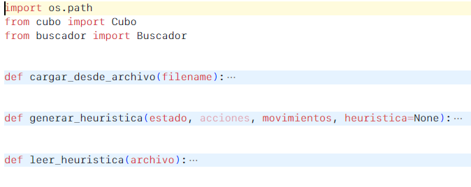

Todas se conectan es decir la clase `Cubo` se lee con el cargar_desde_archivo y se lo pasa al `Buscador` y se utilizan las 2 funciones para usar la heuristica una que crea la heuristica que es `generar_heuristica` y `leer_heuristica` y se encuentra los caminos como vimos este es un resultado

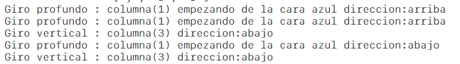

### 5.2. Explicación y justificación de algoritmo(s), técnicas, heurísticas seleccionadas

- Para el uso se utilizaron `ida_star` y `a_star` para la búsqueda de estado. Se observa que `ida_star` es más óptima para el uso de estados grandes debido a que son más estados a visitar.

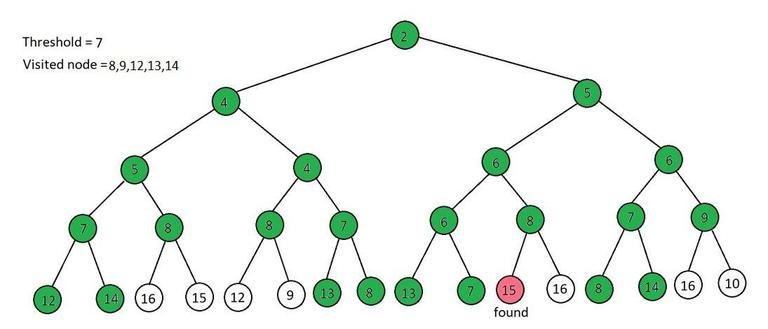

**IDA*** (Iterative Deepening A*) con el umbral simplificado (simplified threshold) es una variante del algoritmo A* que realiza búsquedas incrementales en profundidad controlando el límite de la función heurística. En cada iteración, el umbral se incrementa en el valor mínimo del costo de los nodos no expandidos. Esto garantiza que los nodos con una función heurística menor al umbral sean explorados. El proceso continúa hasta que se encuentra la solución o se supera el umbral global. Este enfoque combina la eficiencia del A* con el espacio de memoria limitado del algoritmo IDA*.

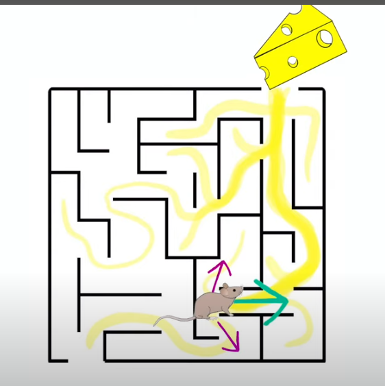

El A* es un algoritmo de búsqueda informada que utiliza una función heurística para determinar qué nodos explorar primero. Evalúa los nodos teniendo en cuenta tanto el costo acumulado desde el inicio como una estimación del costo restante hasta el objetivo. Esto permite una búsqueda más eficiente que el enfoque de búsqueda ciega.

- La heurística utilizada se obtuvo del blog [https://towardsdatascience.com/rubiks-cube-solver-96fa6c56fbe4](https://towardsdatascience.com/rubiks-cube-solver-96fa6c56fbe4)

   - La heurística consiste en generar un archivo que contenga todos los movimientos posibles en un rango de 5 movimientos. Todos los movimientos que se puedan realizar son generados en una base de datos (en este caso, un archivo `.txt`).
   - Funciona de la siguiente manera:

   - *"Para nuestra heurística, adoptaremos un enfoque simple de fuerza bruta y utilizaremos el algoritmo de búsqueda breadth-first para comprobar los nodos. Aquí vamos a almacenar los diferentes estados del cubo y el número de movimientos que tomó para llegar allí desde el cubo resuelto en una tabla hash"*

       1. Primero, se genera la heurística:

       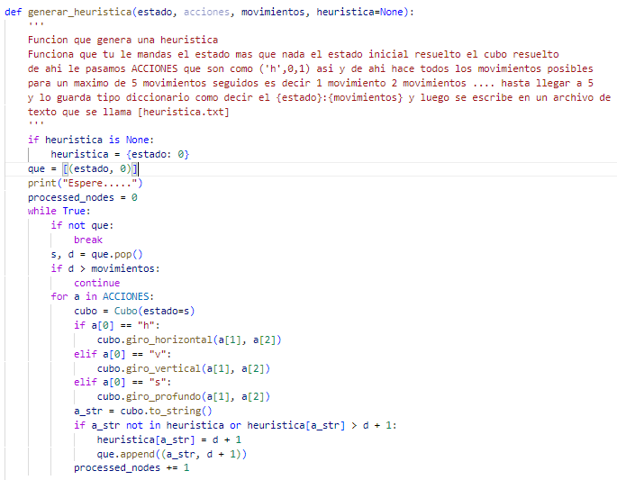

       2. Durante la generación de la heurística, se itera sobre todas las acciones posibles. Luego, para el cálculo de la heurística, se verifica a través del archivo `.txt` que es un diccionario que muestra el estado del cubo y los movimientos realizados para llegar a ese estado.

       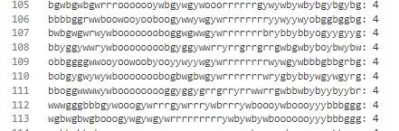

       3. Ahora, para el cálculo de la heurística, se calcula con los movimientos utilizados, por ejemplo, para el A*:

       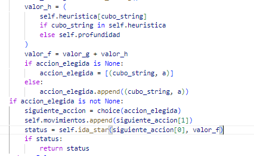

       4. Como se observa, se busca en el diccionario el valor `valor_h`, que es el valor de la heurística. Si ese valor existe, se utiliza. Si no existe, se le da el valor de 20, y así se va iterando.

### 5.3. En caso de usar modelos lingüísticos, incluir los prompts clave

***Chatgpt***: para escoger que metodo de busqueda de estado usar que escogio el A* y el IDA*

## 6. Trabajo Futuro

### 6.1. Lista de tareas inconclusas y/o ideas para continuar con el proyecto
- **Verificación de aristas**: No está verificado que las aristas cumplan el archivo. Los cubos se generaron con el método `mezclar` de la clase `Cubo`.
- **Heurística limitada**: La heurística actual solo considera 5 movimientos, por lo que solo es efectiva para cubos con 5 movimientos. Ocasionalmente, puede funcionar con 6 o 7 movimientos, pero si se pasa un cubo con más de 10 movimientos, es probable que no encuentre el camino.

   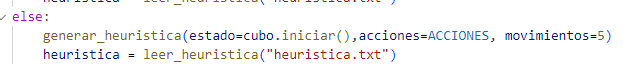

- **Generar heurística directamente**: Encontrar una forma de generar la heurística directamente desde el programa, sin necesidad de un archivo externo.
- **Refactorización**: Intentar no utilizar tantos ciclos anidados y refactorizar el código.
- **Investigar mejores heurísticas**: Indagar para encontrar mejores heurísticas, como la heurística Kociemba.
- **Aumentar el límite de movimientos**: Hacer que el cubo aguante más de 5 movimientos.