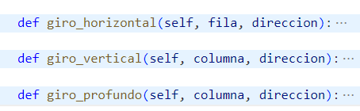
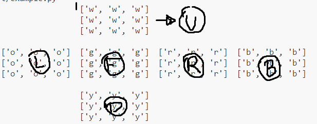
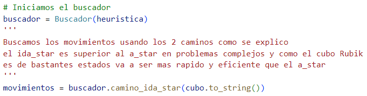
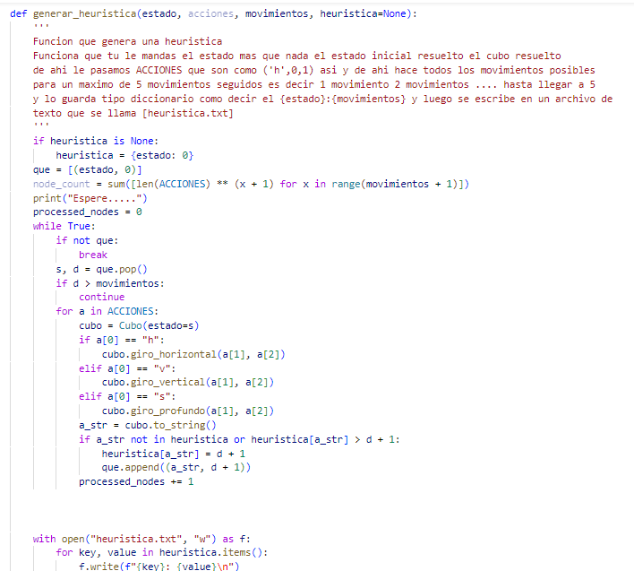
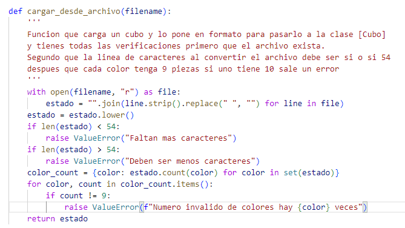
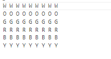
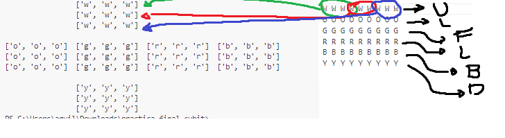

El reporte es meramente técnico y debe incluir los siguientes puntos:
1. Nombre completo del autor(a)
    Dayan Aguilar Alcocer
    
2. Breve descripción del proyecto
    El proyecto consta de 3 clases
    -Cubo: es la clase donde estan todo las funciones que realizan un cubo rubik de estas voy a destacar:
        -El iniciador que es donde se carga un cubo puede ser desde un estado que se pase y si no se genera un estado el estado esta resuelto
        -Los movimientos que basicamente son 3
        
        -Mostrar que es un cubo ya formateado para que el usuario entienda cuales son las caras como dice la imagen que son

            -U:Up(arriba) 
            -F:Front(frente)
            -L:Left(izquieda)
            -R:Right(derecha)
            -B:Back(atras)
            -D:Deep(abajo)
            
    
    -Buscador: basicamente es la clase que recibe el cubo en si y nosotros enviamos un cubo y una heuristica que se tiene que generar en un archivo.txt
    y se envia un diccionario de heuristica tiene 2 algoritmos de busqueda de estado ida_star y el a_star que se explicaran de mejor manera en el paso "5.2"
    se usa de la siguiente manera:
    

    -Main: es el main donde se usa todas las funciones 
    

    Esta funcion genera la heuristica y lo pone en un archivo de texto

    

    Esta funcion agarra los archivos que existen y los convierte en un archvio de texto al 
    leer el archivo se explicara ahora como es el formato del archivo:

    

    Como funciona es de la siguiente manera donde las lineas negras son las caras.

    Y las lineas de colores son las filas
    
    
3. Requerimientos del entorno de programación
4. Manual de uso
4.1.Formato de codificación para cargar el estado de un cubo desde el archivo de texto
4.2.Instrucciones para ejecutar el programa
5. Diseño e implementación
5.1.Breve descripción de modelo del problema
5.2.Explicación y justificación de algoritmo(s), técnicas, heurísticas seleccionadas.
5.3.En caso de usar modelos lingüísticos, incluir los prompts clave.
6. Trabajo Futuro
6.1.Lista de tareas inconclusas y/o ideas para continuar con el proyecto