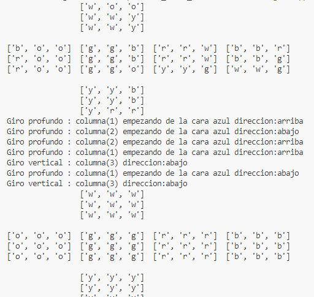

El reporte es meramente técnico y debe incluir los siguientes puntos:
1. Nombre completo del autor(a)
    Dayan Aguilar Alcocer
    
2. Breve descripción del proyecto
    El proyecto consta de 3 clases
    -Cubo: es la clase donde estan todo las funciones que realizan un cubo rubik de estas voy a destacar:
        -El iniciador que es donde se carga un cubo puede ser desde un estado que se pase y si no se genera un estado el estado esta resuelto
        -Los movimientos que basicamente son 3

        
        -Mostrar que es un cubo ya formateado para que el usuario entienda cuales son las caras como dice la imagen que son

            -U:Up(arriba) 
            -F:Front(frente)
            -L:Left(izquieda)
            -R:Right(derecha)
            -B:Back(atras)
            -D:Deep(abajo)
            
    
    -Buscador: basicamente es la clase que recibe el cubo en si y nosotros enviamos un cubo y una heuristica que se tiene que generar en un archivo.txt
    y se envia un diccionario de heuristica tiene 2 algoritmos de busqueda de estado ida_star y el a_star que se explicaran de mejor manera en el paso "5.2"
    se usa de la siguiente manera:
    

    -Main: es el main donde se usa todas las funciones 
    

    Esta funcion genera la heuristica y lo pone en un archivo de texto

    

    Esta funcion agarra los archivos que existen y los convierte en un archvio de texto al 
    leer el archivo se explicara ahora como es el formato del archivo:

    

    Como funciona es de la siguiente manera donde las lineas negras son las caras.

    Y las lineas de colores son las filas
    
    
3. Requerimientos del entorno de programación

    --Python 3.11.1
    
    --300 a 700 mb de espacio 

    --Visual Studio Code

4. Manual de uso

    Para el manual de hay que seguir los siguientes pasos

4.1.Formato de codificación para cargar el estado de un cubo desde el archivo de texto

    Como ya se explico como se usa los cubos con los archivos de texto ahora veremos la funcion y como llamar para ese estado

4.2.Instrucciones para ejecutar el programa

Una vez creado el cubo con el estado cargado desde un archivo tenemos que usar la clase Buscador ya creada la heuristica y el cubo para 

Este es el resultado 

5. Diseño e implementación

5.1.Breve descripción de modelo del problema

5.2.Explicación y justificación de algoritmo(s), técnicas, heurísticas seleccionadas.

--Para el uso se utilizaron ida_star y a_star para la busqueda de estado y se ve que ida_star es mas optima por el uso de estados grande por que son mas estados a visitar.

IDA* (Iterative Deepening A*) con el umbral simplificado (simplified threshold) es una variante del algoritmo A* que realiza búsquedas incrementales en profundidad controlando el límite de la función heurística. En cada iteración, el umbral se incrementa en el valor mínimo del costo de los nodos no expandidos. Esto garantiza que los nodos con una función heurística menor al umbral sean explorados. El proceso continúa hasta que se encuentra la solución o se supera el umbral global. Este enfoque combina la eficiencia del A* con el espacio de memoria limitado del algoritmo IDA*.

El A* es un algoritmo de búsqueda informada que utiliza una función heurística para determinar qué nodos explorar primero. Evalúa los nodos teniendo en cuenta tanto el costo acumulado desde el inicio como una estimación del costo restante hasta el objetivo. Esto permite una búsqueda más eficiente que el enfoque de búsqueda ciega.

--La heuristica utilizada se saco del blog de https://towardsdatascience.com/rubiks-cube-solver-96fa6c56fbe4

    -La heuristica consta de basicamente generar un archivo que tenga todos los movimientos posible en un rango de 5 movimientos todos los movimientos que se puedan realizar son generados en una base de datos(En mi caso en un archivo txt)
    Funciona de la siguiente manera:
    -Primero generamos la heuristica:

    -De ahi se ve al momento de generar la heuristica se va iterando sobre todas las acciones posibles luego para el calculo de la heuristica se verifica a travez del txt que es un diccionario muestra
    el estado del cubo y de ahi los movimientos realizados para llegar a ese estado

    -Ahora para el calculo de la heuristica se calcula con los movimientos utilizados por ejemplo para el A*

    -Como vemos se busca en el dcicionario el valor_h que es el valor de la heuristica si ese valor existe y si no existe se le da el valor de 20 y asi se va iterando.

5.3.En caso de usar modelos lingüísticos, incluir los prompts clave.

**6. Trabajo Futuro**

6.1.Lista de tareas inconclusas y/o ideas para continuar con el proyecto

--Verificacion de aristas: no esta verificado las aristas que cumplan el archivo los cubos se generaron con el metodo mezclar 
  de la clase Cubo

--La heuristica que es solo con 5 movimientos solo aguanta cubos con 5 movimientos de vez en cuando 6 o 7 pero si le pasamos un cubo
  con mas de 10 movimientos de seguro no encontrara el camino
  

--Encontrar una forma de hacer la heuristica que no se genere que sea directo del programa

--Intentar no utilizar tantos ciclos anidados [REFACTORING]
--Indagar para encontrar mejores heuristicas como la hueristica Kociemba

--Hacer que el cubo aguante mas de 5 movimientos.